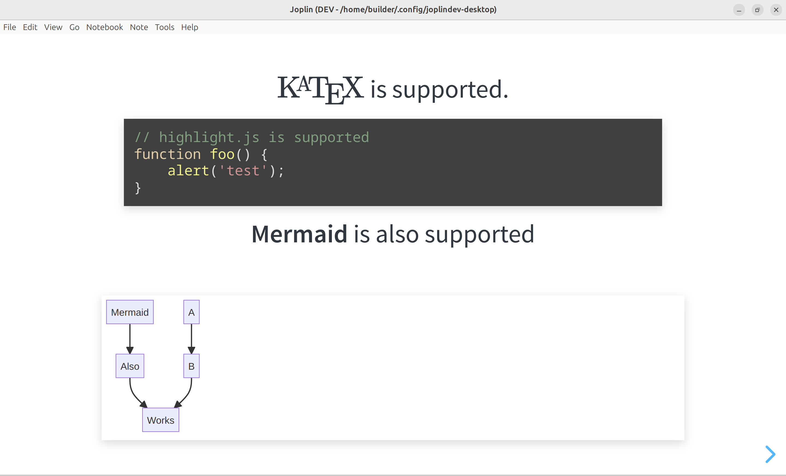

# `joplin-plugin-revealjs-slides`
[On GitHub](https://github.com/personalizedrefrigerator/joplin-plugin-revealjs-slides)

A Joplin plugin for presenting notes using [reveal.js](https://revealjs.com/).



## Example presentation

<details><summary>Example presentation</summary>

````markdown

# `joplin-plugin-revealjs-slides`

---

- Separate slides with `---`s (if you're using the rich text editor, press the "horizontal line" button).
- The rest of this example presentation will assume you're using the markdown editor.

---

This plugin uses [reveal.js](https://revealjs.com/) internally. [Read about writing reveal.js presentations here](https://revealjs.com/vertical-slides/).

---

## A note on markdown rendering

`joplin-plugin-revealjs-slides` uses Joplin's markdown renderer internally *not* `reveal.js`'s markdown renderer.

<!-- Read about fragments here: https://revealjs.com/fragments/ -->
<div class="fragment fade-up">

Thus, some of [reveal.js's markdown features are not supported](https://revealjs.com/markdown/).

</div>
<div class="fragment fade-up">

However, this also means that many of Joplin's built-in features are supported. (For example, slideshows can be customized with [userstyle.css](https://discourse.joplinapp.org/t/introduction-to-customising-joplin-userchrome-css-userstyle-css/21370)).

</div>

---

[Note links can also be included](:/9aeb224225314a1b9d7ee977ffeb3078) (though note that they may not work perfectly!)

Slides can be linked to like this: [link to slide 3](#3).

---

# $\KaTeX$ is supported.

```js
// highlight.js is supported
function foo() {
	alert('test');
}
```

---

**Mermaid** is also supported


````

---

# Keyboard shortcuts

<section>

Press `f` to enter fullscreen and `esc` to exit fullscreen.

</section>
<section>

Press `p` to print the slideshow.

</section>
<section>

Press `q` or navigate to the last slide to show the `Exit` button.

</section>
<section>

Press `?` to see a list of additional shortcuts.

</section>

</details>

## Installing
Search for "reveal.js" under the plugins tab in Joplin's settings.


## Notes
 * **Avoid running a presentation with untrusted markdown input.**
     * While it _should_ be safe to do so, it is very possible that a vulnerability exists.
     * `reveal.js` has features like  [`iframe` backgrounds](https://revealjs.com/backgrounds/#iframe-backgrounds) that could pose a security risk (even though, in the `iframe` case, [this plugin attempts to mitigate this by disabling JavaScript in iframe backgrounds](https://github.com/personalizedrefrigerator/joplin-plugin-revealjs-slides/blob/main/src/dialog/webview.ts#L8)).
 * A keyboard shortcut can be associated with starting the slideshow. To do this, open Joplin's settings, click "Keyboard shortcuts", and search for "slideshow". Next, click in the "keyboard shortcut" column. .
 * Press `?` while in presentation mode to see a list of slideshow shortcuts. 


## Known issues
 * Starting a presentation while the rich text editor is open **may clear your undo history!** The plugin briefly switches to the markdown editor before running the presentation. This switch may cause issues.
 * At present, the plugin's icon in the rich text editor is a gear: 
. [See the upstream bug report](https://github.com/laurent22/joplin/issues/6876)


# Development
## Building the plugin

The plugin is built using Webpack, which creates the compiled code in `/dist`. A JPL archive will also be created at the root, which can use to distribute the plugin.

To build the plugin, simply run `yarn run dist`.

The project is setup to use TypeScript, although you can change the configuration to use plain JavaScript.

## Updating the plugin framework

To update the plugin framework, run `npm run update`.

In general this command tries to do the right thing - in particular it's going to merge the changes in package.json and .gitignore instead of overwriting. It will also leave "/src" as well as README.md untouched.

The file that may cause problem is "webpack.config.js" because it's going to be overwritten. For that reason, if you want to change it, consider creating a separate JavaScript file and include it in webpack.config.js. That way, when you update, you only have to restore the line that include your file.
