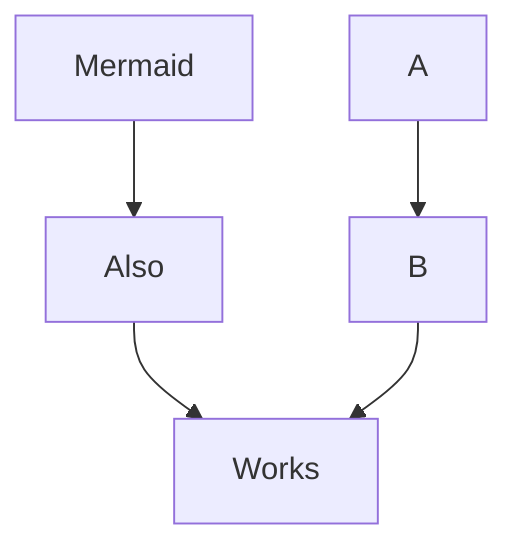

# `joplin-plugin-revealjs-slides`

---

- Separate slides with `---`s (if you're using the rich text editor, press the "horizontal line" button).
- The rest of this example presentation will assume you're using the markdown editor.

---

This plugin uses [reveal.js](https://revealjs.com/) internally. [Read about writing reveal.js presentations here](https://revealjs.com/vertical-slides/).

---

## A note on markdown rendering

`joplin-plugin-revealjs-slides` uses Joplin's markdown renderer internally *not* `reveal.js`'s markdown renderer.

<!-- Read about fragments here: https://revealjs.com/fragments/ -->
<div class="fragment fade-up">

Thus, some of [reveal.js's markdown features are not supported](https://revealjs.com/markdown/).

</div>
<div class="fragment fade-up">

However, this also means that many of Joplin's built-in features are supported. (For example, slideshows can be customized with [userstyle.css](https://discourse.joplinapp.org/t/introduction-to-customising-joplin-userchrome-css-userstyle-css/21370)).

</div>

---

[Note links can also be included](:/9aeb224225314a1b9d7ee977ffeb3078) (though note that they may not work perfectly!)

Slides can be linked to like this: [link to slide 3](#3).

---

# $\KaTeX$ is supported.

```js
// highlight.js is supported (through Joplin's
// markdown renderer).
function foo() {
	alert('test');
}
```

---

**Mermaid** is also supported



---

**Speaker notes** can be created using an
```
<aside class="notes">
    Notes!
</aside>
```

A setting exists to show speaker notes (when available).

<aside class="notes">
    Notes!
</aside>

---

<section>

# Keyboard shortcuts

</section>
<section>

Press <kbd>f</kbd> to enter fullscreen and <kbd>esc</kbd> to exit fullscreen.

</section>
<section>

Press <kbd>p</kbd> to print the slideshow.

</section>
<section>

Press <kbd>q</kbd> or navigate to the last slide to show the `Exit` button.

</section>
<section>

Press <kbd>?</kbd> to see a list of additional shortcuts.

</section>

---

# Animating code blocks

Code blocks with highlighted line numbers need to be specified in HTML. See [the upstream reveal.js documentation](https://revealjs.com/code/#manual-highlighting) for details.

Example:
<pre><code data-trim data-line-numbers="1|3|4">
// This
// is
// a test
// of code blocks.
</code></pre>

---

# More

For additional features, see the [reveal.js documentation](https://revealjs.com/backgrounds/).
