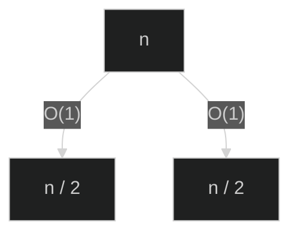
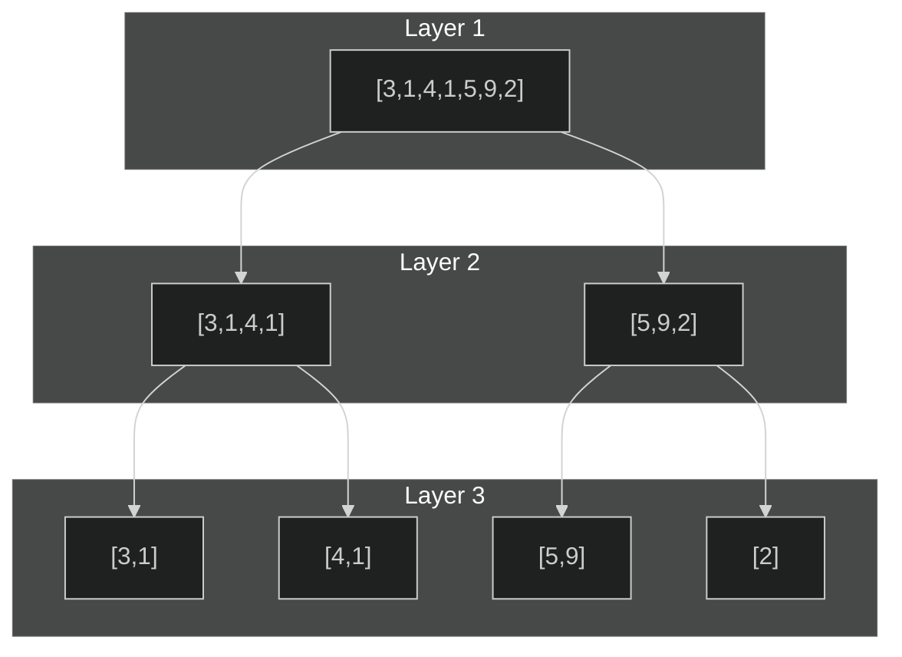
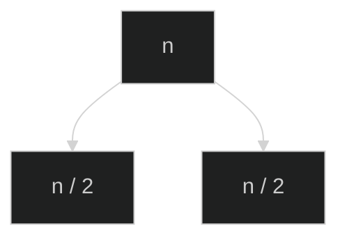
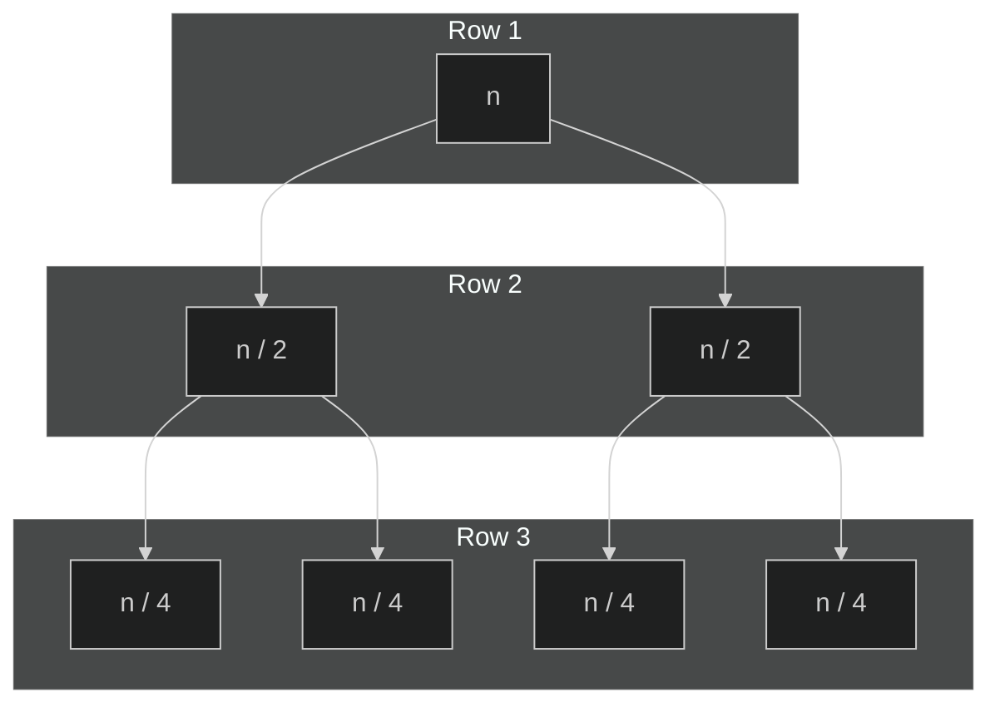

<!--

This presentation demonstrates:
- Auto-animate: https://revealjs.com/auto-animate/
- Overriding the default theme using an <rjs-theme>...</rjs-theme> tag.
- Mixing --- dividers and <section>s. If the space between two --- dividers contains a single <section> with attributes (e.g. data-auto-animate), that <section>'s attributes are used for the slide.
- Using mermaid.js diagrams with a specific theme.

-->

# Merge sort

<rjs-theme>dark-blue</rjs-theme>

---

<section data-auto-animate>

# Merge sort

- Running time $\mathcal{O}(n \log n)$

<pre data-id="code-animation"><code data-trim data-line-numbers>
function mergeSort(list, from, to) {
	;
}
</code></pre>

</section>

---

<section data-auto-animate>

# Merge sort

- Start: Divide the list

<pre data-id="code-animation"><code data-trim data-line-numbers class="language-javascript">
function mergeSort(list, from, to) {
	if (from &lt; to) {
		const half = Math.floor((from + to)/2);
		const start = mergeSort(list, from, half);
		const end = mergeSort(list, half, to);
		return merge(start, end);
	} else {
		...
	}
}
</code></pre>

</section>

---

<section data-auto-animate>

# Merge sort

- Base case.

<pre data-id="code-animation"><code data-trim data-line-numbers class="language-javascript">
function mergeSort(list, from, to) {
	if (from &lt; to) {
		const half = Math.floor((from + to)/2);
		const start = mergeSort(list, from, half);
		const end = mergeSort(list, half, to);
		return merge(start, end);
	} else { // from == to
		return [list[from]];
	}
}
</code></pre>

</section>

---

<section data-auto-animate>

# Merge sort

- Merge
- In this step, we merge two arrays that **we assume are already sorted**.

</section>

---

<section data-auto-animate>

# Merge sort

- Merge

```ts
function merge(a, b) {
	let i = 0, j = 0;
	let result = [];
	while (i < a.length && j < b.length) {
		if (a[i] < b[j]) {
			result.push(a[i++]);
		} else {
			result.push(b[j++]);
		}
	}
	while (i < a.length) result.push(a[i++]);
	while (j < b.length) result.push(b[j++]);
	return result;
}
```

</section>

---

<section data-auto-animate>

# Running time

We'll approach this by representing the problem as a tree and finding the total amount of work at each level.

We include both the **divide** and the **combine** steps in the work for each level.

</section>


---

<section data-auto-animate>

# Running time

  Breaking the array in half is in time $\mathcal{O}(1)$.



</section>

---

<section data-auto-animate>

# Running time

1. Dividing produces a tree with height $\lceil \lg (n) \rceil$.



</section>

---

<section data-auto-animate>

# Running time

1. Dividing produces a tree with height $\lceil \lg (n) \rceil$.
2. We divide once for each split in the graph. Layer $k$ has $k$ splits.


</section>


---

<section data-auto-animate>

# Running time

Each node both **divides** and **merges**. Merging is in $\mathcal{O}(t)$, for node size $t$. Dividing is in $\mathcal{O}(1)$. Thus, processing a node of size $t$ is in $\mathcal{O}(t + 1) = \mathcal{O}(t)$.



</section>

---

<section data-auto-animate>

# Running time

Observe that each row in the tree has $n$ total array elements and node size roughly $n \over 2^k$.



</section>

---

<section data-auto-animate>

# Running time

- Row $k$ has maximum node size $t \approx \frac{n}{2^k}$.
- Row $k$ is in $\mathcal{O}(\texttt{num\_nodes\_in\_row} \cdot t) = \mathcal{O}\left(2^k\cdot\dfrac{n}{2^k}\right) = \mathcal{O}(n)$.

</section>

---

<section data-auto-animate>

# Running time

Thus, all rows are in $\mathcal{O}(n)$:


</section>

---

<section data-auto-animate>

# Running time

Because there are $\lfloor \lg n \rfloor$ rows and each row is in $\mathcal{O}(n)$, the algorithm must be in $\mathcal{O}(n \lg n)$.

<sub style="font-size: 10pt;">See also https://www.khanacademy.org/computing/computer-science/algorithms/merge-sort/a/analysis-of-merge-sort</sub>

</section>
